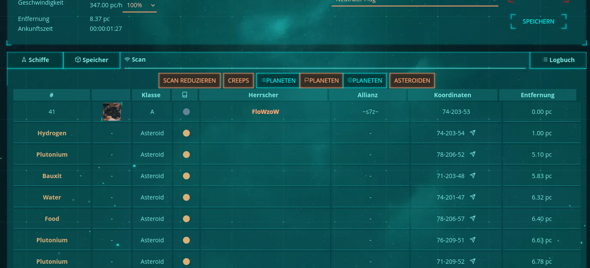

# UniverseDawnAstroRessourceScript

A Tampermonkey Script for the Browsergame Universe Dawn, which translates Asteroid-Names into Ressource-Names

Written by FloWzoW - [flozi.dev](https://flozi.dev)

# 🧩 Installation des Tampermonkey-Skripts

## 🇩🇪 Anleitung

### 1️⃣ Tampermonkey installieren

**Für Firefox:**  
👉 [Tampermonkey im Firefox Add-on-Store installieren](https://addons.mozilla.org/de/firefox/addon/tampermonkey/)

**Für Google Chrome:**  
👉 [Tampermonkey im Chrome Web Store installieren](https://chromewebstore.google.com/detail/tampermonkey/dhdgffkkebhmkfjojejmpbldmpobfkfo?pli=1)

> ⚠️ **Hinweis für Chrome-Nutzer:**
>
> - Chrome erlaubt standardmäßig keine „Userscripts“ außerhalb des Chrome Web Store.
> - Falls das Skript nach der Installation nicht startet oder nicht angeboten wird, öffne Tampermonkey (Erweiterungs-Icon → „Dashboard“) und überprüfe:
>   - Ob das Skript **aktiviert** ist (grüner Schalter oben rechts).
>   - Ob Tampermonkey auf die gewünschte Seite zugreifen darf („Zugriff auf alle Websites“ in den Chrome-Erweiterungseinstellungen aktivieren).
> - Wenn Chrome fragt, ob „User Scripts“ erlaubt werden sollen, **bestätige dies**.
> - Bei Problemen hilft oft auch, Tampermonkey kurz zu deaktivieren und wieder zu aktivieren oder Chrome neu zu starten.

---

### 2️⃣ Skript installieren

Nachdem Tampermonkey installiert ist, klicke auf folgenden Link:  
👉 [Hier zum Skript](https://github.com/FloWzoW/UniverseDawnAstroRessourceScript/raw/refs/heads/main/Universe%20Dawn%20Fleet%20Asteroid%20Replacer.user.js)

Tampermonkey sollte sich automatisch öffnen und das Skript anzeigen.  
Drücke dann auf **„Installieren“**.

---

### 3️⃣ Überprüfung

Nach der Installation:

- Öffne Tampermonkey (Icon oben rechts im Browser).
- Prüfe, ob das Skript in der Liste erscheint und **aktiviert** ist.
- Lade ggf. die Spielseite neu, damit das Skript aktiv wird.

> 💡 **Tipp:** Falls nach einem Browser-Update das Skript nicht mehr funktioniert, öffne den Tampermonkey-Dashboard und prüfe, ob Updates für das Skript oder Tampermonkey selbst verfügbar sind.

---

## 🇬🇧 English Instructions

### 1️⃣ Install Tampermonkey

**For Firefox:**  
👉 [Install Tampermonkey from the Firefox Add-ons Store](https://addons.mozilla.org/de/firefox/addon/tampermonkey/)

**For Google Chrome:**  
👉 [Install Tampermonkey from the Chrome Web Store](https://chromewebstore.google.com/detail/tampermonkey/dhdgffkkebhmkfjojejmpbldmpobfkfo?pli=1)

> ⚠️ **Note for Chrome users:**
>
> - Chrome may block userscripts that are not from the Chrome Web Store.
> - If the script doesn’t load or install automatically, open the Tampermonkey dashboard and check:
>   - Whether the script is **enabled** (green toggle in the top right).
>   - Whether Tampermonkey has permission to access all sites (under **Manage Extension → Site Access**).
> - If Chrome asks you to allow “User Scripts,” confirm this.
> - Restarting Chrome or re-enabling Tampermonkey can sometimes fix installation issues.

---

### 2️⃣ Install the Script

After Tampermonkey is installed, click the following link:  
👉 [Open the Script](https://github.com/FloWzoW/UniverseDawnAstroRessourceScript/raw/refs/heads/main/Universe%20Dawn%20Fleet%20Asteroid%20Replacer.user.js)

Tampermonkey should open automatically and display an installation window.  
Click **“Install.”**

---

### 3️⃣ Verify Installation

Once installed:

- Open the Tampermonkey dashboard from the browser toolbar.
- Check that the script is listed and **enabled**.
- Reload the game page to activate the script.

> 💡 **Tip:** If the script stops working after a Chrome update, open the Tampermonkey dashboard and check for updates to the script or to Tampermonkey itself.
